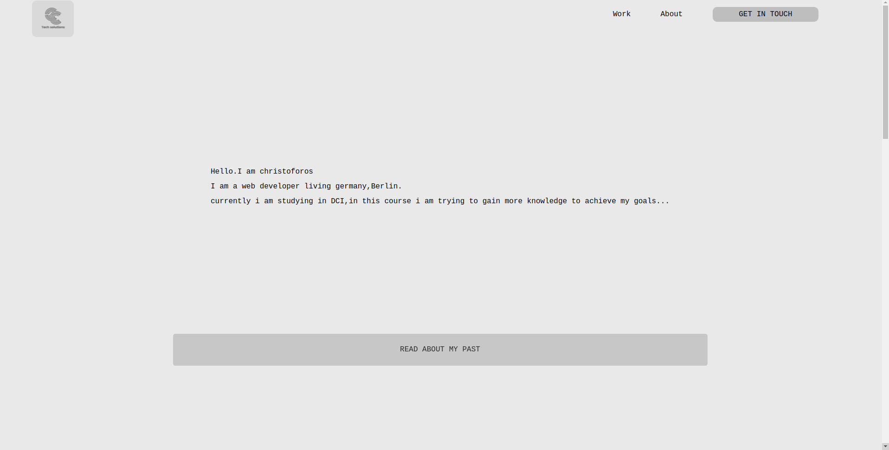

## Portofolio project v1

---

## screenshot  project 

#### Navigation

- About Project
  - _Description_
  - _Developed With_
- How to use this Project
  - _Description_
  - _Developed With_
- Contact
  - _Mail_ 
  - _GitHub_
  - _LinkedIn_
- Used Tools
  - _Fonts_
  - _Design_
  - _Icons_
  - _Colors_

---

### About Project

####portofolio project 

this is my personal portofolio more details soon 

### How to use this Project

more dtails soon 

##### Developed With

- [x] 
- [x] 
- [x] 	
- [x] 
- [ ] 
- [ ] 

- [ ] _..._

---

### Contact

Mail: <christopher.choras@yahoo.com> 

---

### Used Tools

---
